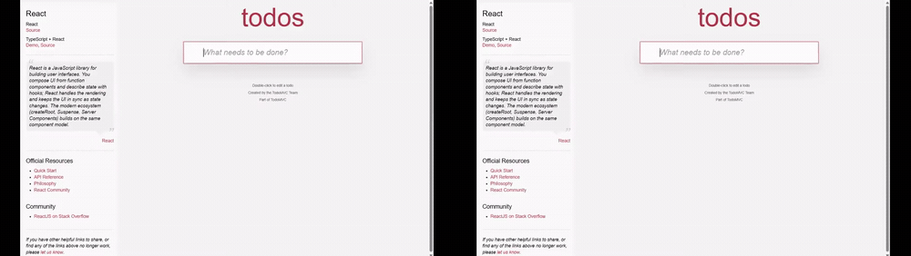

# Cutscene

Cutscene records a Chrome tab and the DOM events behind it. The editor uses
recorded element bounds to frame clicks instead of guessing from cursor
coordinates.



Same recording. Cursor-position zoom on the left; recorded-element zoom on the
right.

## Limitations

- Chrome only.
- DOM-based web applications only. Canvas, WebGL, maps, and similar surfaces
  fall back to pixels because they do not expose useful semantic elements.
- Cross-origin iframes cannot be traced.
- Shadow DOM is traced only when its root is open.
- Recordings stay local. There is no hosted service, account system, or backend.

## What works today

- Tab video capture with optional microphone audio.
- A versioned JSONL trace containing clicks, inputs, navigation, scrolling,
  viewport changes, ranked locators, element bounds, and clock-sync markers.
- Capture-time masking for input values and sensitive elements.
- A local editor with an event list and trace lane. Hover a tick to inspect its
  recorded element; click it to seek.
- Automatic element-locked zooms with manual add, delete, retime, and retarget
  controls.
- Element-anchored callouts rendered consistently in preview, GIF, and MP4.
- Preconfigured CSS-selector blur tracks with enable/delete controls and the
  same redaction in preview, GIF, and MP4.
- README GIF export with one global palette, plus 1080p H.264 MP4 export.

## Run locally

You need Chrome, Node.js, and pnpm 11.6.0.

```sh
pnpm install
pnpm build
```

Open `chrome://extensions`, enable **Developer mode**, choose **Load unpacked**,
and select `packages/extension/dist`.

Start the editor:

```sh
pnpm --filter @cutscene/editor exec vite
```

Open the local URL printed by Vite.

## Record and edit

1. Open a DOM-based page in Chrome.
2. Open the Cutscene extension. Add any CSS selectors that must be visually
   blurred, then start recording. Microphone capture is optional.
3. Stop recording. Chrome downloads `media.webm`, `trace.jsonl`, and `meta.json`
   into one `cutscene-<recording-id>` folder.
4. Choose that folder in the editor.
5. Inspect the trace, adjust zoom segments, then export a GIF or MP4.

## Measured result

The Phase 1 acceptance run recorded 60.1459 seconds with 15 clicks. Ten sampled
zooms landed on the correct element; mean timing error was 0.258 frame and the
maximum was 0.422 frame. The 800×450 README GIF was 2,352,555 bytes at 15fps.
See [the evidence report](docs/phase-1-evidence.md) for the full measurements.

Phase 1 passed. Phase 3 is in progress. See [`STATUS.md`](STATUS.md) for the
current implementation evidence and gate history.

## Development

```sh
pnpm test
pnpm typecheck
pnpm build
pnpm e2e
```

The repository has three active packages:

- `packages/extension` — Manifest V3 capture extension.
- `packages/trace` — schema, privacy, locators, clock mapping, coordinates, and
  zoom generation.
- `packages/editor` — local React editor and FFmpeg export pipeline.
